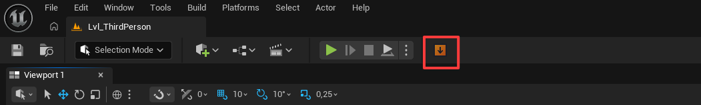
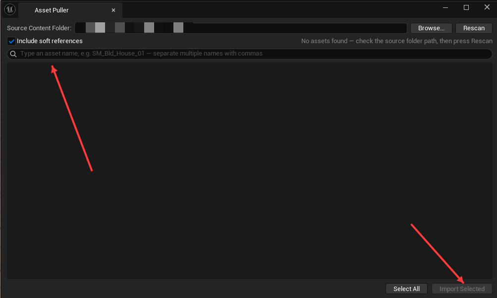
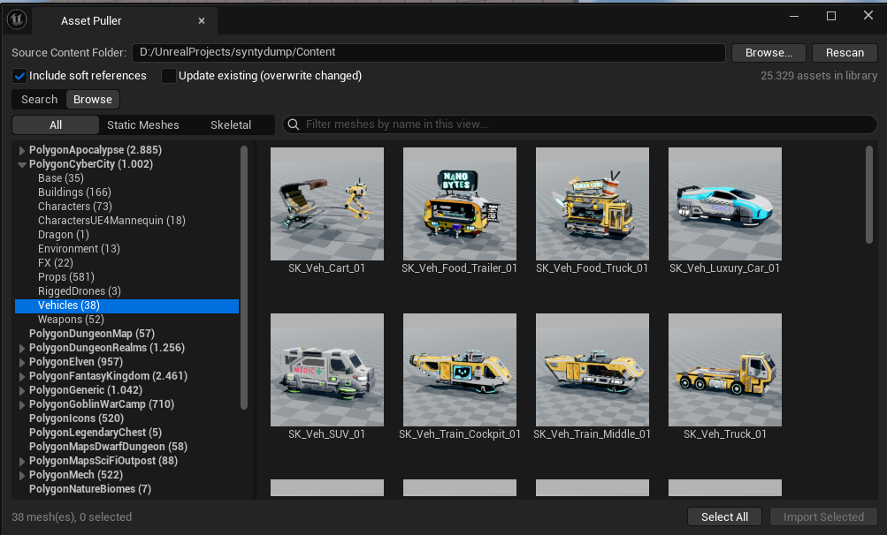

# Asset Puller

An Unreal Engine 5.7 editor plugin that pulls assets **by name** from a separate
"asset library" project into your current project — copying the asset **and its
entire transitive dependency chain** (materials, textures, physics assets, map
external actors, ...) while preserving folder paths so nothing ever breaks.

The typical workflow it solves: you keep one big library project containing all
your purchased asset packs (Synty, Fab/Marketplace packs, etc.). Instead of
migrating whole packs into every game project, you type `SM_Bld_House_01` in your
game project and get exactly that house — plus the materials and textures it
needs — nothing more.

## Highlights

- **The source project is never opened.** The plugin reads `.uasset`/`.umap`
  package headers straight from the library's Content folder on disk, so the
  data is always up to date — no stale registry, no second editor instance.
- **Full dependency closure.** Hard imports, soft references (optional toggle),
  map `_BuiltData`, and One-File-Per-Actor external actor/object packages are
  all resolved and copied.
- **Reference-safe by construction.** Files are copied with their relative
  Content paths preserved, so package names stay identical and references
  resolve without redirectors. Both projects must use the same engine version.
- **Never overwrites.** Anything that already exists in the target is skipped
  and reported. Interrupted copies can't leave corrupt files behind (temp file
  + atomic rename). Maps that already exist in the target never get actors
  injected into them.
- **Opt-in update mode.** Tick *Update existing* to sync assets whose content
  changed in the library (e.g. after a pack update): only files that actually
  differ are overwritten, the old files are backed up to
  `Saved/AssetPullerBackups/<timestamp>/`, loaded assets are refreshed in the
  editor, and maps are never touched.
- **Thumbnails in the search list and Browse grid**, read straight from the
  library's package files — no loading, no source project involved.
- **Visual Browse mode.** Browse the library by pack and category in a
  virtualized thumbnail grid (smooth over 25k+ assets) instead of only
  searching by name — no external asset index needed. Meshes are grouped
  into a pack → category tree with counts; filter by Static/Skeletal and by
  name, then import with the same dependency-resolving flow.
- **Instant open on huge libraries.** The index is cached per project; the
  window opens with last session's index immediately while a fresh scan runs
  in the background and swaps in seconds later.
- **Preview before copy.** A confirmation dialog lists what will be copied
  (with total size), what will be skipped, and anything missing in the source.
- **Live search** over the whole library (100k+ assets), comma-separated
  multi-name input, multi-select import.
- **Headless mode** via a commandlet for batch scripts and CI.

## Requirements

- Unreal Engine **5.7** (source and target projects on the same version)
- Windows (uses standard engine APIs; other platforms untested)
- A C++ toolchain (Visual Studio 2022) to build the plugin once

## Installation

1. Copy the `AssetPuller` folder into your project's `Plugins` directory:
   `YourProject/Plugins/AssetPuller`
2. Open the project. If prompted to rebuild the plugin, accept (requires
   Visual Studio). For Blueprint-only projects, build once from any C++-enabled
   project on the same engine version, then reuse the folder with its
   `Binaries` directory included — no further compilation needed.
3. Check *Edit → Plugins → Asset Puller* is enabled (it is by default).

## Setup

Point the plugin at your library once, in either place:

- **Project Settings → Plugins → Asset Puller → Source Content Folder**, or
- the *Source Content Folder* field at the top of the Asset Puller window.

This is the **Content folder of the library project** on disk, e.g.
`X:/Projects/AssetLibrary/Content`. The setting is saved per project in
`Config/DefaultEditor.ini`.

## Usage

1. Click the **Asset Puller** toolbar button (or *Window → Asset Puller*):

   

2. Type an asset name — the list filters as you type. Separate several names
   with commas. Select one or more results (Ctrl/Shift click, or *Select All*),
   then click **Import Selected**:

   

3. Review the confirmation dialog:
   - green — new assets that will be copied (with total size)
   - grey — already in your project, skipped
   - red — referenced but missing in the source library
   - a warning appears when the selection includes maps (they can pull
     thousands of dependencies)
4. Confirm. Assets appear in the Content Browser immediately; a summary
   notification shows copied/skipped counts. Details are logged under the
   `LogAssetPuller` category.

Added new packs to the library? Press **Rescan** — the index is rebuilt from
disk in seconds.

### Browsing visually

Don't know the exact asset name? Switch to the **Browse** tab and explore the
library visually. Pick a pack — or a category within it — in the left tree,
and its meshes appear as thumbnails on the right. Filter by **Static Meshes**
/ **Skeletal**, or type in the filter box to narrow the current view by name.
Select tiles (Ctrl/Shift click, or *Select All*) and click **Import
Selected** — the same dependency-resolving import runs, so materials and
textures come along automatically.



Packs are derived from the library's folder structure (nested `Synty/` packs
are flattened up, and folder-name variants like `Meshes`/`Models` are
merged). Browse shows **meshes only** — static (`SM_`/`geo_`) and skeletal
(`SK_`); other asset types are pulled automatically as dependencies. Maps,
blueprints, and engine template content are hidden here — use *Search* to
pull those by name.

## Example workflow: Synty Pass

This plugin pairs naturally with a [Synty Pass](https://syntystore.com/)
subscription: install the POLYGON packs you want into a single "library"
project once, and point Asset Puller's *Source Content Folder* at that
project's Content directory. Your game projects stay lean — you pull or
browse individual assets instead of migrating whole packs.

**Browse mode replaces the need for an external asset index.** Earlier
versions relied on Synty's online [Dex](https://dex.syntystore.com/) to look
asset names up before searching; the built-in **Browse** tab now shows every
mesh with its thumbnail, grouped by pack and category, so you can find and
import assets entirely inside the editor. Dex is still available online as an
optional cross-reference, but it is no longer required.

## Command line

```
UnrealEditor-Cmd.exe <project.uproject> -run=AssetPuller -Names=SM_A,SM_B
    [-Source=<library Content folder>] [-NoSoft] [-Update] [-DryRun] [-VerifyLoad]
```

- `-Source` overrides the folder from Project Settings
- `-NoSoft` ignores soft references
- `-Update` overwrites existing assets whose content differs in the library
  (old files are backed up to `Saved/AssetPullerBackups`; maps are never updated)
- `-DryRun` prints the resolved plan without copying anything
- `-VerifyLoad` fully loads every copied package afterwards to prove the
  references are intact (useful in automated tests)

Exit code is non-zero when an asset name isn't found, a copy fails, or
`-VerifyLoad` finds a broken package.

## How it works (short version)

1. The source Content folder is scanned for `.uasset`/`.umap` files to build a
   name index (filenames only — fast).
2. For each requested asset, the plugin opens the package file with the
   engine's `FPackageReader` and reads its import table (hard dependencies)
   and soft package reference list, then walks the graph transitively.
   For maps it also collects `__ExternalActors__`/`__ExternalObjects__`
   packages by folder convention (they are not listed in the map's imports).
3. Every package that exists in the source but not in the target is copied to
   the same relative path under the target's Content folder. Because Unreal
   references packages by their `/Game/...` path, identical relative paths
   mean identical package names — references simply keep working.
4. The target's asset registry is rescanned for the new files, so they show up
   in the Content Browser without restarting the editor.

## Safety rules

- Existing target files are never overwritten (checked under both `.uasset`
  and `.umap` extensions to avoid duplicate package names). The only exception
  is the explicit *Update existing* mode, which backs up every file it
  replaces and shows exactly what will be overwritten before doing it.
- External actor/object packages are only copied when their owning map is
  copied in the same operation.
- The source folder must not overlap the target project's own Content folder.
- Copies go through a temp file and are renamed into place, so a crash or
  cancellation never leaves a truncated asset.

## License

MIT — see [LICENSE](LICENSE).
